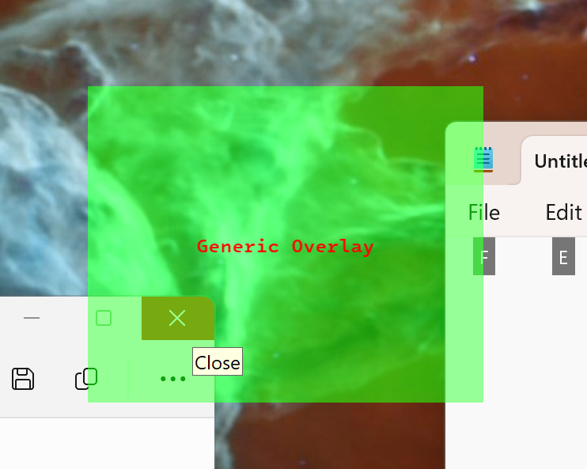

### Generic Overlay

This is a sample program demonstrating a cross-platform overlay window.



#### Features
- Translucent
- Borderless
- Always on top
- Text rendering
- System tray (Notification Area)
- Click-through (transparent to mouse events)

#### Dependencies
- SDL3
- SDL3_ttf
- Xfixes extension (only on POSIX)

#### Build

Download this [TTF font file](https://github.com/intel/intel-one-mono/blob/main/fonts/ttf/IntelOneMono-Medium.ttf) and place it in the same directory with the resulting executable.

##### Windows (MSVC)
1. Download and extract in `%SDL_LIBS%`
   - [SDL3-devel-3.2.10-VC.zip](https://github.com/libsdl-org/SDL/releases/download/release-3.2.10/SDL3-devel-3.2.10-VC.zip)
   - [SDL3_ttf-devel-3.2.2-VC.zip](https://github.com/libsdl-org/SDL_ttf/releases/download/release-3.2.2/SDL3_ttf-devel-3.2.2-VC.zip)
1. Clone this repo
1. ```
   cd GenericOverlay
   md build
   cd build
   cmake -G Ninja -DCMAKE_PREFIX_PATH=%SDL_LIBS%\SDL3-3.2.10;%SDL_LIBS%\SDL3_ttf-3.2.2 ..
   ninja
   ```
1. Alternatively, the code can be compiled directly `cl /EHs /std:c++20 main.cc /I %SDL_LIBS%\SDL3-3.2.10\include /I %SDL_LIBS%\SDL3_ttf-3.2.2\include /link /Core:WINDOWS /LIBPATH:%SDL_LIBS%\SDL3-3.2.10\lib\x86 /LIBPATH:%SDL_LIBS%\SDL3_ttf-3.2.2\lib\x86 SDL3.lib SDL3_ttf.lib user32.lib`

##### POSIX
1. Install your favourite C++ compiler + SDL3-devel and SDL3_ttf-devel e.g. `zypper install SDL3-devel SDL3_ttf-devel` on openSUSE.
1. Clone this repo
1. ```
   cd GenericOverlay
   mkdir build
   cd build
   cmake -G Ninja ..
   ninja
   ```
1. Alternatively, the code can be compiled directly ``g++ main.cc -std=c++20 -o main -lX11 -lXfixes `pkg-config --cflags --libs sdl3 sdl3-ttf` ``
